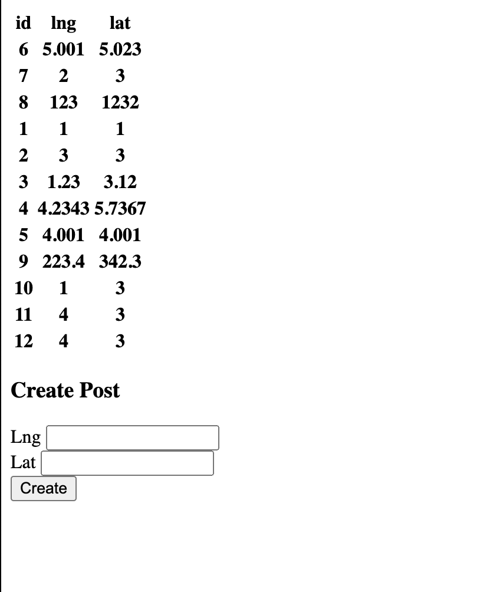
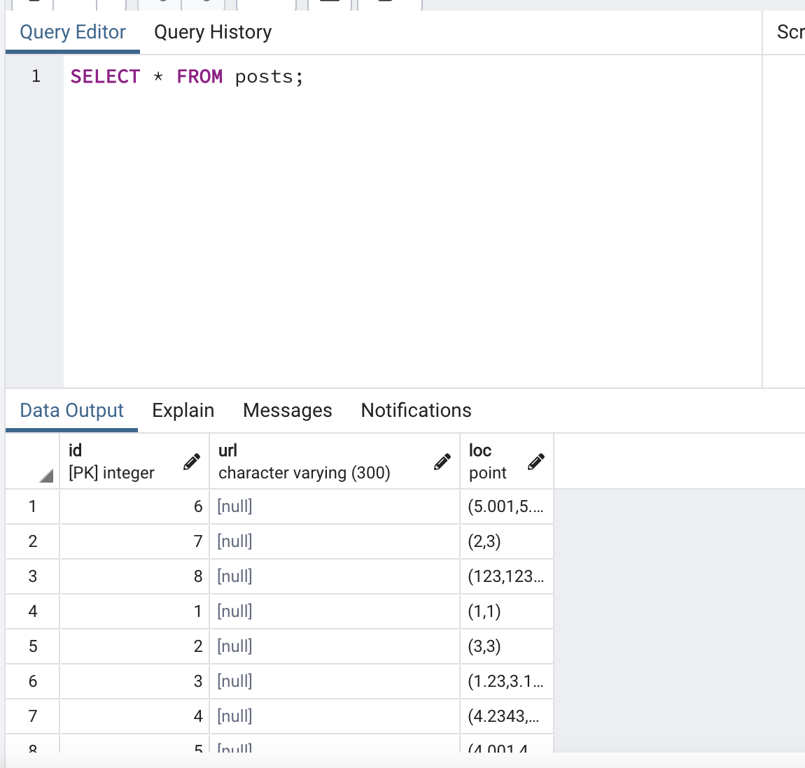

# Getting Started

1. Run `npm install`

2. Start the app with `node index.js`

## Running migrations

1. Start your Postgres database locally with `psql` and connect using [pgAdmin](https://www.pgadmin.org/) as UI

2. Create a database called `socialnetwork`

3. When you run migrations, use the command:
```
// Up
DATABASE_URL=postgres://{Your mac username}@localhost:5432/socialnetwork npm run migrate up

// Down
DATABASE_URL=postgres://{Your mac username}@localhost:5432/socialnetwork npm run migrate down
```

> Up steps forward in the migration, Down will reverse the Up command

## Migration Strategy

This demonstrates a migration from a table that uses the columns `lat` and `lng` for storing a geolocation, to refactoring those columns into one `loc` column that represents a (x,y) coordinate location point.

This migration strategy prevents the issue where writes might happen during the changeover. (and hence prevents writes to the wrong columns)

1. Create a table with lat and lng

2. create another column with loc

3. Update the router code to send values to lat, lng and loc additionally.

4. Backfill data into previous rows by transforming the `lat`, `lng` column data

5. Finally, it is safe to remove lat and lng columns from the database and the router.

## Website


## PgAdmin
